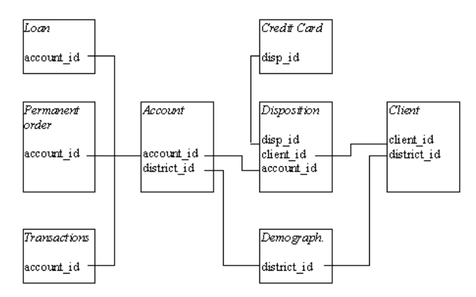

```{r setup, include=FALSE}
knitr::opts_chunk$set(echo = TRUE)
knitr::opts_chunk$set(fig.pos =  "h")
knitr::opts_knit$set(root.dir = "../")

# loading required libraries
library(rmarkdown)
library(dplyr)
library(ggplot2)
library(tidyr)
library(lubridate)
library(ggalluvial)
library(stringr)
library(VIM)
library(psych)
library(ggthemes)
library(tinytex)
```

```{r include=FALSE}
# loading required steps before performing the analysis
source("./scripts/step_01_create_functions.R")
source("./scripts/step_02_data_ingestion.R")
#source("./scripts/step_03_data_cleaning.R")
#TO-DO: to discuss with team how to handle data cleaning
source("./scripts/step_04_label_translation.R")
source("./scripts/step_05_data_enhancement.R")
```

# Berka Bank (setting the scene)

## Domain
Onde upon a time, there was a bank offering services to private persons. The services include managing of accounts, offerings loans, etc.

## Task descripion

The bank wants to improve their services. For instance, the bank managers have only vague idea, who is a good client (whom to offer some additional services) and who is a bad client (whom to watch carefully to monimize the bank loses).

Fortunately, the bank stores data about their clients, the accounts (transactions within several months), the loans already granted, the credit cards issued.

The bank managers hope to improve their undestanding of customers and seed specific actions to improve services.

A mere application of discovery tool will not be convincing for them.

## Data description

This database was prepared by Petr Berka and Marta Sochorova.

```{r data_model_pic, echo=FALSE, out.width = '800px', fig.align='center', fig.cap='The partial logical data model of Berka Bank.'}

```

## Project at GitHub
This project can be found and downloaded at GitHub: https://github.com/ldaniel/R_Bank_Berka

> Valar Morghulis!
> :)

*******************************************************************************

# Data ingestion, cleaning, translation and enhancement

Before starting the Berka Analysis, a few important steps were taken in order to prepare the source data files. These steps are listed below:

- **Step 01**: Create Functions;
- **Step 02**: Data Ingestion;
- **Step 03**: Data Cleaning;
- **Step 04**: Label Translation;
- **Step 05**: Data Enhancement.

## Create Functions
This step create functions to be used in the next steps. Following, all functions created were described.

### GetGenderFromBirthnumber 
The birth_number column is given in the form of YYMMDD for men, and YYMM+50DD for women. The objective of this function is to return the gender of the client via the birth_number.

```
GetGenderFromBirthnumber <- function(var_birth_number) {
  
  month <- substr(var_birth_number, 3, 4)
  result <- ifelse(as.integer(month) > 50, "female", "male")
  
  return(as.factor(result))
}
```

### GetBirthdateFromBirthnumber
The birth_number column is given in the form of YYMMDD for men, # and YYMM+50DD for women. The objective of this function is to return the final birthday as Date.

```
GetBirthdateFromBirthnumber <- function(var_birth_number, var_gender) {
 
  year <- paste("19", substr(var_birth_number, 1, 2), sep="")
  month <- ifelse(var_gender == "male", substr(var_birth_number, 3, 4), 
  as.integer(substr(var_birth_number, 3, 4)) - 50)
  day <- substr(var_birth_number, 5, 6)
  result <- as.Date(paste(year, "-", month, "-", day, sep=""), format = "%Y-%m-%d")
  
  return(result)
}
```

### ConvertToDate
The objective of this function is to convert the strange bank date style to the regular R Date datatype.

```
ConvertToDate <- function(var_date) {
  
  year <- paste("19", substr(var_date, 1, 2), sep="")
  month <- substr(var_date, 3, 4)
  day <- substr(var_date, 5, 6)
  result <- as.Date(paste(year, "-", month, "-", day, sep=""), format = "%Y-%m-%d")
  
  return(result)
}
```

### GetAgeFromBirthnumber
The objective of this function is to get age given the birth_number.

```
GetAgeFromBirthnumber <- function(var_birth_number) {
  
  base_year <- 99 # considering 1999 as the base year for this exercise
  year <- substr(var_birth_number, 1, 2)
  result <- base_year - as.integer(year)
  
  return(result)
}
```

## Data Ingestion
During this step, in addition to the loading data processes, it was performed data casting, column renaming and small touch-ups. The list below describe each table adjustment taken:

- **District**: renaming columns and casting columns with decimal or "?" values;
- **Credit Card**: casting column issued in creditcard table from string to datetime data type;
- **Account**: casting column date in account table from string to datetime data type;
- **Loan**: casting columns in table loan to the right data types;
- **Permanent Order**: casting columns with decimal values;
- **Transaction**: casting columns in table transaction to the right data types.

## Data Cleaning

The objective of this step was analysing missing values and other strange conditions. In order to accomplish this task, a few R functions were used to quickly discover missing values, like NA and empty fields.

The following command were used in each table to find out where NA values. 

```
sapply(transaction, function(x) sum(is.na(x)))
```
Solely the transaction table has 760931 NA's in the account column.

```
sapply(transaction, function(x) table(as.character(x) =="")["TRUE"])
```
Again, only the transaction table has empty values, in the following columns:

- operation: 183114 empty cells;
- k_symbol: 481881 empty cells;
- bank: 782812 empty cells.

## Label Translation
In order to make the data information more understandable, it was translated some relevant labels and domains from Czech to English.

## Data Enhancement
This step aims to improve the analysis by adding auxiliary information.

The code below get gender, birthday and age from birth_number column in using *GetGenderFromBirthnumber* and *GetBirthdateFromBirthnumber* functions.

```
client <- client %>% 
  mutate(gender = GetGenderFromBirthnumber(birth_number)) %>% 
  mutate(birth_date = GetBirthdateFromBirthnumber(birth_number, gender)) %>% 
  mutate(age = GetAgeFromBirthnumber(birth_number))
```

The code below improved loan data by having a classification regarding its payment status.

```
loan <- mutate(loan, defaulter = 
                as.logical(plyr::mapvalues(status, c ('A','B','C','D'), 
                                           c(FALSE,TRUE,FALSE,TRUE))),
                contract_status = plyr::mapvalues(status, c ('A','B','C','D'), 
                                 c('finished','finished','running','running')),
                                 type = 'Owner')
```

The code below improved client data by having its age group.

```
client <- mutate(client, age_bin = paste(findInterval(age, 
                 c(10, 20, 30, 40, 50, 60, 70, 80, 90, 100)) * 10,'+'))
```

*******************************************************************************

# The Berka Bank Analysis

## Gender Exploration

At first glance, gender equality is well balanced in the bank, even when observed over the decades. Even more impressive, gender equality is everywhere in the country.

```{r gender_distribution_analysis, echo=TRUE, out.width = '100%'}
# gender distribution of clients in the bank
ggplot(data = client) +
  aes(x = gender, fill = gender) +
  geom_bar() +
  labs(title = "Gender distribution of clients in the bank",
       subtitle = "A well balanced bank",
       x = "Gender",
       y = "Total clients") +
  theme_economist()

clientGenderOverDecades <- client %>% 
  group_by(decade = as.integer(substr(client$birth_number, 1,1)) * 10, 
           gender = client$gender) %>% 
  count()

# gender distribution of clients in the bank over the decades
ggplot(data = clientGenderOverDecades) +
  aes(x = decade, fill = gender, weight = n) +
  scale_x_continuous(breaks = c(0, 10, 20, 30, 40, 50, 60, 70, 80)) +
  geom_bar() +
  geom_line(aes(y = n, color = gender)) +
  labs(title = "Gender distribution of clients in the bank over the decades",
       subtitle = "Equality at its finest",
       x = "Decades",
       y = "Total clients") +
  theme_economist() +
  facet_wrap(vars(gender))

# alluvial diagram representation of gender, age group and region
clientGenderAgeGroupByRegion <- client %>% 
  mutate(age_group = ifelse(age < 21, "young", 
                     ifelse(age >= 21 & age <= 60, "adult", "senior"))) %>% 
  inner_join(district, by = "district_id") %>% 
  group_by(age_group, gender, region) %>% 
  count()
  
ggplot(data = clientGenderAgeGroupByRegion, 
       aes(axis1 = region, axis2 = age_group, y = n)) +
  scale_x_discrete(limits = c("region", "age group"), expand = c(.1, .1)) +
  xlab("Demographic") +
  geom_alluvium(aes(fill = gender), knot.pos = 0) +
  geom_stratum() + 
  geom_text(stat = "stratum", label.strata = TRUE) +
  theme_economist() +
  ggtitle("Region and age group by gender", "Equality is everywhere") 
```

## Loan Exploration

```{r Loan_status_by_region, echo=TRUE, out.width = '100%'}
left_join(loan, disposition, by = 'account_id') %>% 
  left_join(client, by = 'client_id') %>% 
  left_join(district, by = 'district_id') %>% 
  group_by(region, contract_status, defaulter) %>% 
  summarise(count = n(),
            amount = sum(amount)) %>% 
  group_by(region, contract_status) %>% 
  mutate(count_contract_status = sum(count),
         amount_contract_status = sum(amount)) %>% 
  group_by(region) %>% 
  mutate(count_region = sum(count),
         amount_region = sum(amount)) %>% 
  ggplot(aes(x = defaulter, y = contract_status, fill = count / count_region)) +
  geom_bin2d(stat = 'identity') +
  geom_text(aes(label = paste(round(count / count_region * 100, 2), '%')), 
            color = 'white') +
  facet_wrap(~region) +
  theme_economist() +
  theme(legend.position = 'none', panel.grid.major = element_blank(), 
        panel.grid.minor = element_blank()) +
  labs(x = 'Defaulter', 
       y = 'Contract Status', 
       title = 'Loan Contract Status by Region Heatmap')
```

```{r Loan_status_by_gender, echo=TRUE, out.width = '100%'}
left_join(loan, disposition, by = 'account_id') %>%
  left_join(client, by = 'client_id') %>% 
  left_join(district, by = 'district_id') %>% 
  group_by(gender, contract_status, defaulter) %>% 
  summarise(count = n(),
            amount = sum(amount)) %>% 
  group_by(gender, contract_status) %>% 
  mutate(count_contract_status = sum(count),
         amount_contract_status = sum(amount)) %>% 
  group_by(gender) %>% 
  mutate(count_gender = sum(count),
         amount_gender = sum(amount)) %>% 
  ggplot(aes(x = defaulter, y = contract_status, 
             fill = count / count_gender)) +
    geom_bin2d(stat = 'identity') +
    geom_text(aes(label = paste(round(count / count_gender * 100, 2), '%')), 
              color = 'white') +
    facet_wrap(~gender) +
    theme_economist() +
    theme(legend.position = 'none', panel.grid.major = element_blank(), 
          panel.grid.minor = element_blank()) +
    labs(x = 'Defaulter',
         y = 'Contract Status',
         title = 'Loan Contract Status by Gender Heatmap')
```

```{r Loan_status_by_age_bin, echo=TRUE, out.width = '100%'}
left_join(loan, disposition, by = 'account_id') %>%
  left_join(client, by = 'client_id') %>% 
  left_join(district, by = 'district_id') %>% 
  group_by(age_bin, contract_status, defaulter) %>% 
  summarise(count = n(),
            amount = sum(amount)) %>% 
  group_by(age_bin, contract_status) %>% 
  mutate(count_contract_status = sum(count),
         amount_contract_status = sum(amount)) %>% 
  group_by(age_bin) %>% 
  mutate(count_age_bin = sum(count),
         amount_age_bin = sum(amount)) %>% 
  ggplot(aes(x = defaulter, 
             y = contract_status, fill = count / count_age_bin)) +
    geom_bin2d(stat = 'identity') +
    geom_text(aes(label = paste(round(count / count_age_bin * 100, 2), '%')), 
              color = 'white') +
    facet_wrap(~age_bin) +
    theme_economist() +
    theme(legend.position = 'none', panel.grid.major = element_blank(), 
          panel.grid.minor = element_blank()) +
    labs(x = 'Defaulter',
         y = 'Contract Status',
         title = 'Loan Contract Status by Age Group Heatmap')
```

## Account Balance Exploration

```{r avg_account_balance_by_gender_and_region, echo=TRUE, out.width = '100%'}
account_balance <- arrange(transaction, desc(date), account_id) %>%
  group_by(account_id) %>%
  mutate(avg_balance = mean(balance)) %>%
  filter(row_number() == 1) %>% 
  select(account_id, date, balance, avg_balance)

colnames(account_balance) <- c("account_id", "last_transaction_date", 
                               'account_balance', 'avg_balance')

left_join(account_balance, disposition, by = 'account_id') %>%
  left_join(client, by = 'client_id') %>% 
  left_join(district, by = 'district_id') %>% 
  filter(type == 'Owner') %>% 
  ggplot(aes(avg_balance)) +
    geom_density(alpha = 0.5, aes(fill = gender)) +
    scale_x_continuous(labels = scales::comma) +
    labs(title = 'Average Account Balance Distribution by Gender and Region') +
    theme_economist() +
    facet_wrap(~region)
```

# Conclusion
To.do
